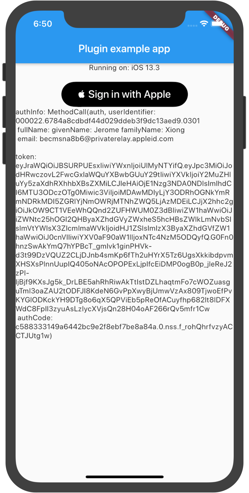

# siwa
[](https://pub.dartlang.org/packages/siwa)

A new sign in with apple.

sign in with apple for flutter

<!--  -->


## Getting Started

1. info.plist
```xml
	<key>io.flutter.embedded_views_preview</key>
	<true/>
```
2. Capability add `Sign In With Apple` option

**注意⚠️**
如若还无法弹出授权，删除Xcode缓存并运行`flutter clean`
